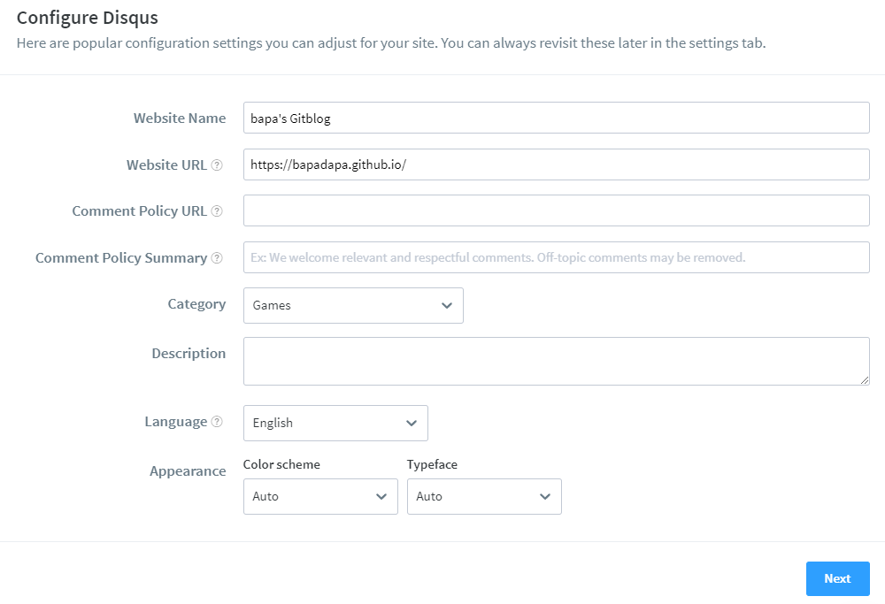

---

# disqus 사이트 설정

1. [disqus](https://disqus.com/) 를 이용하여 댓글생성
1. 해당 사이트에 들어가서 가입/ 로그인을 해준다
1. Settings ( 톱니바퀴모양 ) 를 클릭하고, `Add disques to site`를 클릭
1. Get Start를 클릭해준다

1. `I want to install Disqus on my site` 를 클릭해준다

1. 안에 적혀있는 값들을 넣어준다.
   - 블로그 명은 아무렇게나 해준다
   - Theme 도 원하는거 아무거나..
1. 우리는 돈이 없으니 아래로 내려 Subscribe를 눌러 Basic을 사용하자
1. 그 후 Jeykll을 찾아 클릭해준다 ( 우리가 사용하는 것이 Jeykll이기 때문.)
1. 다 클릭하면 Configure 버튼을 눌러준다

1. 
   - 다음과 같이 정보 입력이 생긴다
   - Website URL은 필수다 본인 Gitblog 주소를 명확히 작성하자

---

# Comments 적용시키기

1. `Post 만들 때마다 추가하기`
   - 예시
     ```yml
     ---
     layout: single
     title: "GitBlog - 댓글 생성"
     comments: true
     ---
     ```
1. `_config.yml에 추가`
   > 아래 옵션들은 추가해도 Local에서는 적용 안 되니, Push하고 실제 블로그에서 확인하면 된다.

```yml
# 33번 줄에 있엇다
# 그 언저리 찾아보면 된다.
comments:
  provider: "disqus"
  disqus:
    shortname: bapa's Gitblog

# 가장 마지막줄
# Defaults
defaults:
  # _posts
  - scope:
      path: ""
      type: posts
    values:
      layout: single
      author_profile: true
      read_time: true
      comments: true # 왼쪽과 같이 기본값을 true로하면 자동 추가됨
      share: true
      related: true
      show_date: true
```
